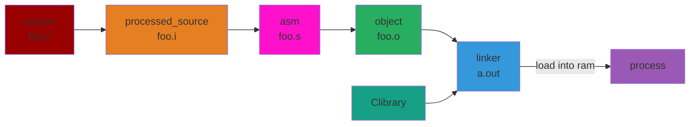
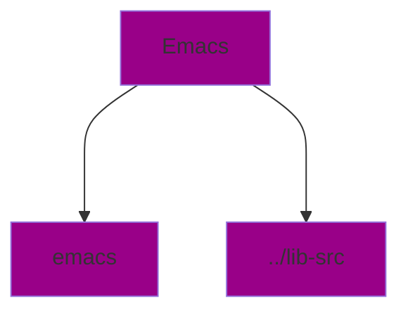

# C and Make files

__Layers:__

* Scripting languages: Python, JS
* Applications + Libraries: Rust, C++, C
* OS Kernel
* CPUs and GPUs
* FPGAs (new hardware)

In an application we have to manage the whole stack

* performance issues
* security problems
* correctness

C++ has:

* classes, objects, polymorphism, inheritance, encapsulation
* struct can have static data members
* namespace control
* easy overloading
* easy exception handling
* I/O cin and cout

In C:

* setjmp & longjmp
* <stdio.h> printf


In C++ we can escape into C by doing:

* `extern "C" {....}`

Compiling: 

```
gcc foo.c
g++ foo.c
```



```
gcc -E foo.c > foo.i        // goes from source to processed_source
gcc -S foo.i                // goes from processed_source to asm file
gcc - c foo.s               // will convert asm to binary(object)
gcc foo.o                   // will link the object to C library
./a.out                     // will run the program
```

Ways to debuf:

Using GCC to "debug"/improve your program without using GDB

* security improvement

`gcc -D_FORTIFY_SOURCE=2 -O2` equivalent to doing `#define _FORTIFY_SOURCE 2`

`fortify(strcmp(a, b))` will make sure a and b are both strings

it will also do memory bound checking in standard functions

`gcc -fstack_protector`

* stack overflow
* ROD gadgets (Return Oriented Programming)

When a program gets called, at the end of stack fram a canary is placed there: `int canary = random_val;`

At the end of program, if the cannary is not equal to te same value, abort();

`gcc -cf_protection = full` works for x86-64 with CET (control-flow enhancement tech)

When you call a function it will push onto both the mains tack and a "secret stack. The main stack permissions are `rw-` and the secret stack's permissions are `---`. When you return, if what is popped from stack is different the program aborts.

### Performance Improvements:

`gcc -O -O2 -O3 -O4` optimizes for speed, O3 and O4 are experimental. Use O2 for better optimization and checking

`gcc Os` optimizes for size

`gcc -Og` optimizes, but keeps it debuggable

`gcc --coverage` will generate instrumented program. gprof reads the source and instrumented output to see commonly executed code. This makes a histogram of common code.

`unreachable()` if called, the program do whatever it wants

```
#include <stddef.h>

long l(long l) {
    return i/2 - 1;         // (>>1) - 1 is not valid for negative 
                            // numbers so gcc cannot do this optimization
}

long l(long l) {
    if (i < 0) unreachable();       // this allows gcc to make the shift right optimization
    return i/2 - 1;
}
```

## Make

1. Autogen creates files not stored in git, includes configure shellscript
2. `./configure` creates files designed for building on this machine
    * interrogates current build system for tis capabilities
    * can result in you doing stuff to get it to configure
    * more platform specific files - `makefiles`
3. `make` executables + compiled files

`make check` does self check on the files we have built but not installed. Also called `unit tests`

`make install` exports it to the rest of the system

`makefile` the recipe for a build

* target: dependency list, commands

make has a dependency graph



The benefit of having a makefile as a graph, is that you can build in parallel. Shell cannot be ran in parallel as easily.

`/proc/cpuinfo` tells you information about your machine

Example: intel core i5-13354

Raptor Lake:

* 2 P cores (performance), hyperthreaded
* 8 E cores (efficiency)

`hyperthreaded cores` can execute 2 instructions in parallel (2 threads per core)

Therefore we can run 12 threads simultaneously

`make -j12` will make 12 processes run simultaneously

* by default `make -j` will run as many processes as possible


### Rules

```
target: dependencies
    commands
```

`target` the file being generated

`dependencies` files needed to build the target

`commands` typically a shell command

### Variables

`variables` store reusable strings (compiler flags, file lists)

```
CC = gcc
CFLAGS = -Wall -g

hello: hello.o main.o
    $(CC) $(CFLAGS) -o hello.o main.o
```

### Automatic Variables

`$@` target name

`$<` the first depedency

`$^` all dependencies

```
%.o: %.c
    $(CC) $(CFLAGS) -c $< -o $@
```

### Pattern Rules

pattern rules define how to build multiple targets with similar recipe

```
%.o: %.c
    gcc -c $< -o $@
```

### Phony Targets

these commands don't produce files

```
.PHONY: clean
clean:
    rm -f *.o hello
```

