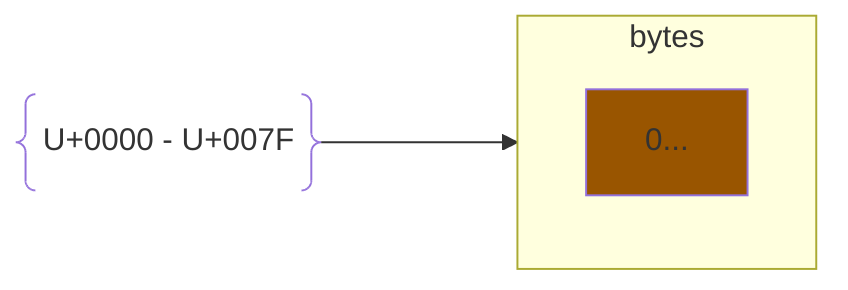
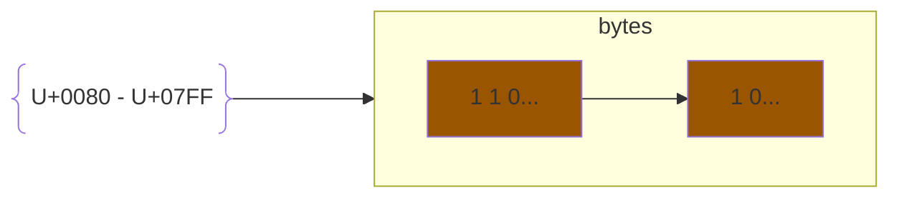
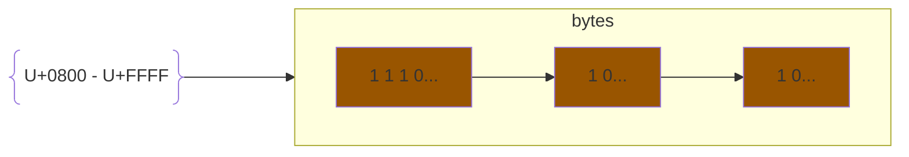
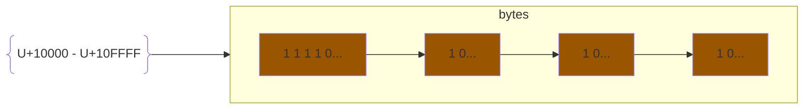

# Character Encoding

Problem of representing text in computers and on networks.

Originally, the list of characters was a small list of `64` characters. These could be represented in `2^6` ways or a `6 bit character encoding`. Each word was seperated into 6 bytes comprised of 6 bits each.

This was an IBM system 360, with `byte addressable memory`.

Later on a list of `258` or  `2^8` characters was needed. This was done through `8 bit encoding`. This is similar to 6 bit encoding except there was 8 bits per byte and 8 bytes per word. The character set was called `EBCDIC` or `Extended Binary Coded Decimal Interchange Code`.

### ASCII

`ASCII` is a 7 bit character set using 8 bit bytes. The highest order bit is the parity bit.

* 128 code points of which 95 are printable
* `0 to 31` are control characters
* `32 to 126` are printable characters
* `127` is the DEL character

### Extensions of ASCII for other languages: (256 bit character sets)

* `ISC/IEC 8859-1` Latin-1 for Western Europe
* `ISC/IEC 8859-2` Latin-2 for Eastern Europe
* `ISC/IEC 8859-3` Latin-3 for Southern Europe
* `ISC/IEC 8859-4` Latin-4 for Northern Europe
* `ISC/IEC 8859-15` Latin-9 (Latin-1 + €) basically Latin-1 but support for most European languages.

```js
// Protocol Header:
    Content-Type: text/plain; charset=iso8859-6     // default was Latin-1
```

### Dealing with more than 256 characters

Let's take a look at `2^16` characters. Microsoft tried to do `2 bytes per character` with a total of `16 bits`. Most companies were not a fan of this.

Instead, a variable length encoding for characters was adopted.

```
multibyte                  | |         payload          |       2^15 characters for payload

single byte characters     | |  payload |       2^7 characters for payload
ASCII (7 bit each)
```

### Microsoft Shift JIS (Japan) vs. EUC Extended Unix Code

`Microsoft Shift JIS` was Microsoft's attempt at variable length encoding. However this was not backwards compatible. For example if you were searching for a certain character, the search will break when it recognizes the first half of a multibyte for a different character.

`Unicode` a single set of code points for all languages. There are about 150,000 characters supported on Unicode. Unicode was originally 16 bits, `UTF-16`, Unicode Transformation Format with multi(2 byte) encoding.

`UTF-8` the most common on the internet (95%)

* `0 to 127` was ASCII
* `128 to 255` was ISO 8859-1









To get the next character in a search, just skip bytes that starts with a `1` and `0`.
Suppose the following input bytes: 

* `11111010`. This is not a valid UTF-8 byte, so it is an `encoding error`.
* `10...` This is not a valid start of a UTF byte. It is an `unexpected continuation byte`.
* `truncated sequence` is a valid start of a UTF sequence but it is missing a continuation byte. Either can happen:
    * end of the file
    * non continuation byte

In the original version of UTF-8, the ranges of encoding started at 0. This caused problems because there were multiple ways to get a chracter.

```c
    strcmp(str, "root");
```

The code above breaks because it compares bytes. This is also called `overlong encoding`.


### Unicode Problems

* `homoglyph` characters that look the same, but are different
* `synoglyph` characters that are the same, but look different (different fonts)
* `normalization` forces sequences to be a certain order.
    * C + ◌̧ = Ç this is a capital C and a combining cedilla
    * q + ◌̣ + ◌̄ + ◌̃ is different sequence from q + ◌̄ + ◌̣ + ◌̃, but they output the same character
* `RTL(right to left) or LTR(left to right), bidi(biderectional) problem`

`U+00B5` $\mu$ the micro sign is obselete

`U+03BC` $\mu$ the greek small letter mu is normally used

```c
    stricmp("root", "rOot");
    // ignores lower and upper case
```

Given a text file, `foo.txt`, how do you tell the encoding of the file?

* have some metadata that specifies the encoding

In Python, we can turn strings to a byte string to compare by using:

```python
    y = x.encode()
    z = y.decode()
```

