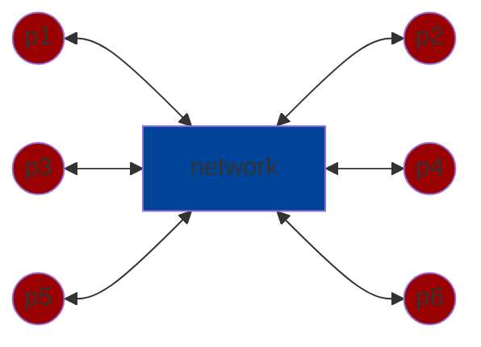
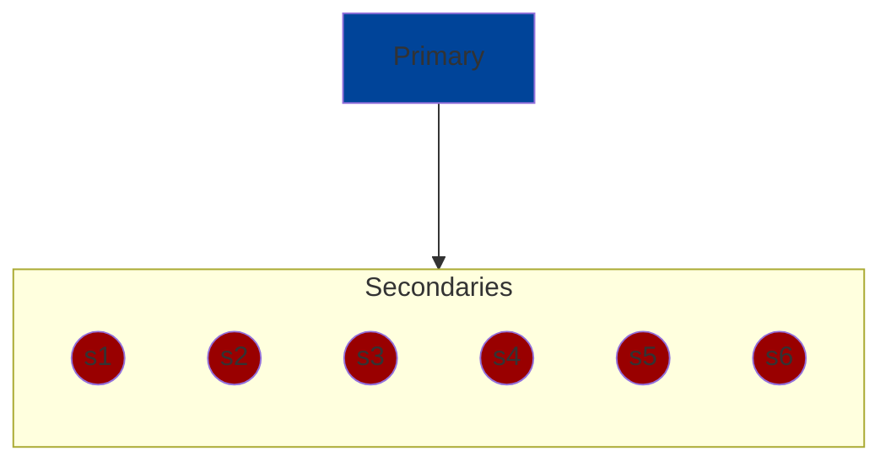
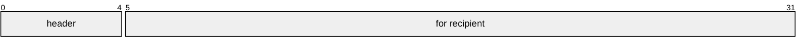

# Client Server Computing

`Server` has authority of what happens to the clients. `Client` requests permission from the server through the `network` to do tasks.

`Node` and `React` environments are used to create client-server architechtures. They are built atop of GNU, Linux. Some concepts in common with emacs is:

* configuration
* quoting

## Alternatives to Client Server Systems:

### Peer-to-Peer (P2P)

* no single peer has all of the authority
* even if one peer goes down, the system can still run

### Primary-Secondary

* primary keeps track of what secondary does and tells them what to do. Primary has all of the authority.

## Issues with these Distributive Systems

`Performance`

* `throughput` how much useful work per second can the system do (important for server operators)
    * to improve throughput
        * do actions in parallel
        * do actions out of order
* `latency` time between request and response time (important to end users/clients)
    * to improve latency
        * clients can cache data

`Correctness`

* `serialization` take all actions done, put them in a serial order and use that order to explain observations
* Does the cache need to be correct?
    * can client code do useful work witho ut of date caches.
* `Cache Validation` expensive to fetch cache. An alternative is to fetch the timestamp of the last cache and compare current version of cache.

## Networking

Before the internet, there was `circuit switching`

* there was a reserved capcity
* this means there was gauranteed performance(throughput and latency)
* typically it transmitted at `20 kb/s`

`Packet Switching`

* messages were divided into `packets`
* there is no reservation of capacity
* packets were typically 1500 bytes

Packet Switching is `more effiecient` with `less setup`, but it was `less reliable`.

### 3 Problems with Packets

* they can be lost (router overload)
* they can be received out of order
* they can be duplicated (bridge/router misconfiguration)

`header` also `network overhead` is what the network uses to identify a packet.

The right part of the packet is the info that is being transmitted.

`Protocols` are rules for exchanging packets

## Internet Protocol Suite (Internet RFC, Request for Comments)

### Layers:

* Application Layer: app specific
* Transport Layer: data channels
* Internet Layer: packets
* Link layer: point-to-point

### Internet Layer

#### Internet Protocol (IPv4)

* connectionless
* header:
    * length
    * protocol number
    * source and destination address (32 bits each. Ex: 192.54.239.12. Each decimal between the periods is a byte)
    * `TTL` time to live or hop count. Each time a packet is transmitted this gets decremented. When it is0, the packet is ignored
    * checksum (16 bit) deals with hardware errors.

#### IPv6

* same as IPv4 with improvments
* 128 bit addresses instead of 32 bits

### Transport Layer

`UDP` User Datagram Protocol

* thin layer over IP

`TCP` Transmission Control Protocol

* data stream that is:
    * reliable
    * ordered
    * error-checked
* so it does:
    * divides stream into packets
    * flow control - makes sure data isn't transmitted too quickly
    * retransmission & reassembly

### Application Protocol

`RTP` real time protocol

* runs ontop of UDP. Does not use TCP because it jitters
* designed for video/audio

Examples:

* Zoom WebRTC (atop RTP)
* `HTTP` HyperText Transfer Protocol

1. `HTTP` protocol for exchanging interesting documents
2. `HTML` standard format for text multimedia document

HTTP is a super-simple protocol

* each request and response has a seperate TCP stream
* security was not in mind when HTTP was created. 
* HTTPS is the secure alternative.

