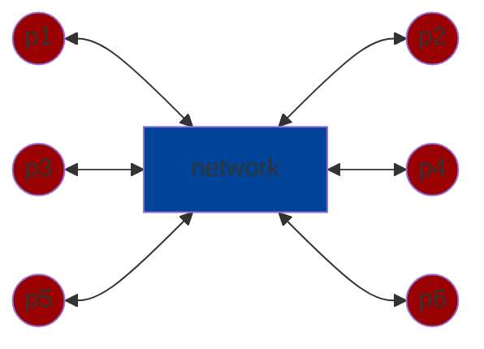
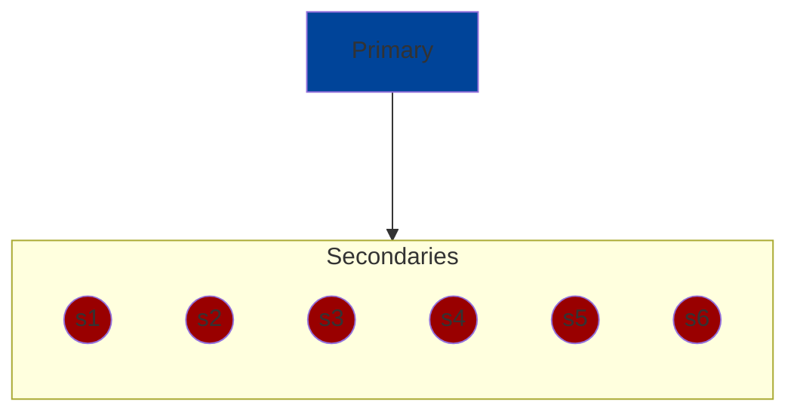
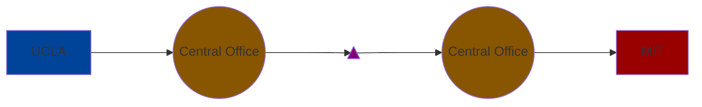
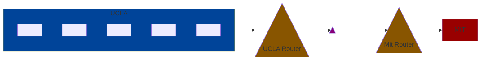
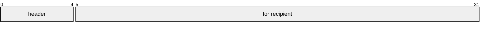
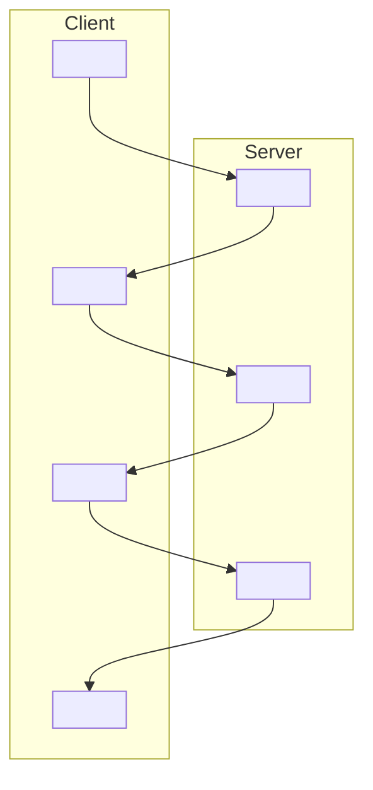
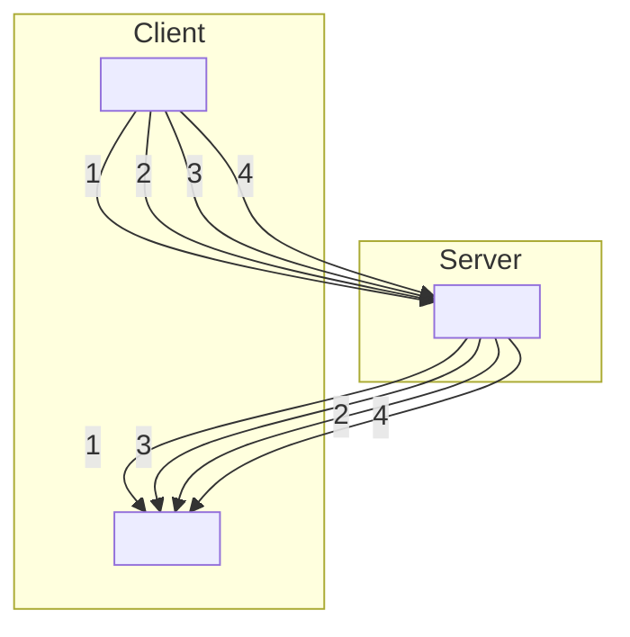
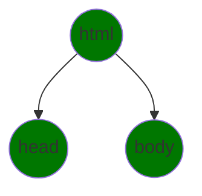
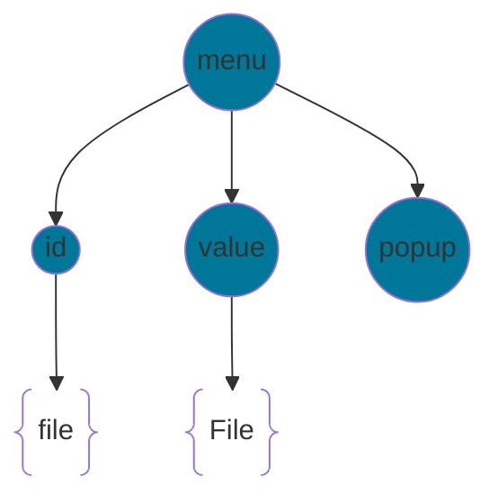
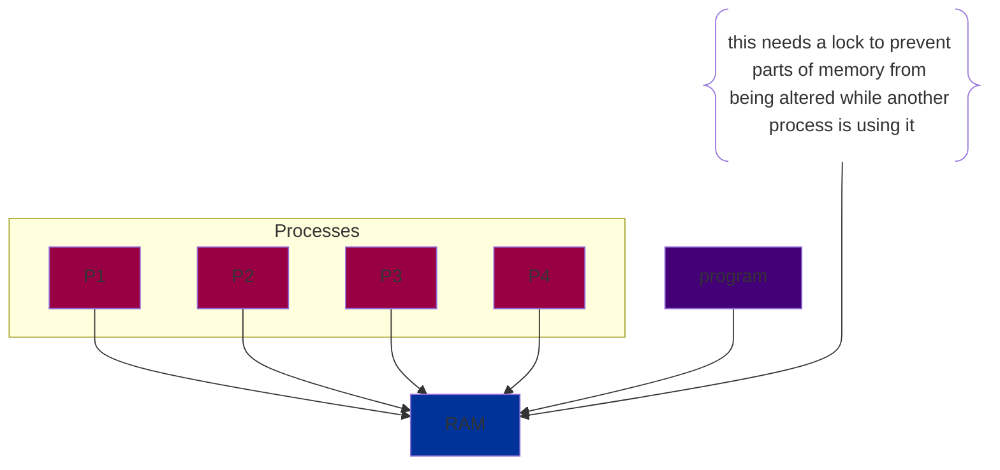

# Client Server Computing


`Server` has authority of what happens to the clients. `Client` requests permission from the server through the `network` to do tasks.

`Node` and `React` environments are used to create client-server architechtures. They are built atop of GNU, Linux. Some concepts in common with emacs is:

* configuration
* quoting

## Alternatives to Client Server Systems:

### Peer-to-Peer (P2P)

* no single peer has all of the authority
* even if one peer goes down, the system can still run



### Primary-Secondary

* primary keeps track of what secondary does and tells them what to do. Primary has all of the authority.



## Issues with these Distributive Systems

`Performance`

* `throughput` how much useful work per second can the system do (important for server operators)
    * to improve throughput
        * do actions in parallel
        * do actions out of order
* `latency` time between request and response time (important to end users/clients)
    * to improve latency
        * clients can cache data

`Correctness`

* `serialization` take all actions done, put them in a serial order and use that order to explain observations
* Does the cache need to be correct?
    * can client code do useful work witho ut of date caches.
* `Cache Validation` expensive to fetch cache. An alternative is to fetch the timestamp of the last cache and compare current version of cache.

## Networking

Before the internet, there was `circuit switching`



* there was a reserved capcity
* this means there was gauranteed performance(throughput and latency)
* typically it transmitted at `20 kb/s`

`Packet Switching`



* messages were divided into `packets`
* there is no reservation of capacity
* packets were typically 1500 bytes

Packet Switching is `more effiecient` with `less setup`, but it was `less reliable`.

### 3 Problems with Packets

* they can be lost (router overload)
* they can be received out of order
* they can be duplicated (bridge/router misconfiguration)



`header` also `network overhead` is what the network uses to identify a packet.

The right part of the packet is the info that is being transmitted.

`Protocols` are rules for exchanging packets

## Internet Protocol Suite (Internet RFC, Request for Comments)

### Layers:

* Application Layer: app specific
* Transport Layer: data channels
* Internet Layer: packets
* Link layer: point-to-point

### Internet Layer

#### Internet Protocol (IPv4)

* connectionless
* header:
    * length
    * protocol number
    * source and destination address (32 bits each. Ex: 192.54.239.12. Each decimal between the periods is a byte)
          * local IP addresses are used for communication on your own network. For example Localhost (127.0.0.1) is a private IP address to start a react app in.
          * public IP addressses are the way for you to connect to the internet. public IP addresses are assigned by your internet service provider (192.54.239.12).
    * `TTL` time to live or hop count. Each time a packet is transmitted this gets decremented. When it is0, the packet is ignored
    * checksum (16 bit) deals with hardware errors.

#### IPv6

* same as IPv4 with improvments
* 128 bit addresses instead of 32 bits

### Transport Layer

`UDP` User Datagram Protocol

* thin layer over IP

`TCP` Transmission Control Protocol

* data stream that is:
    * reliable
    * ordered
    * error-checked
* so it does:
    * divides stream into packets
    * flow control - makes sure data isn't transmitted too quickly
    * retransmission & reassembly

### Application Protocol

`RTP` real time protocol

* runs ontop of UDP. Does not use TCP because it jitters
* designed for video/audio

Examples:

* Zoom WebRTC (atop RTP)
* `HTTP` HyperText Transfer Protocol

1. `HTTP` protocol for exchanging interesting documents
2. `HTML` standard format for text multimedia document

HTTP is a super-simple protocol

* each request and response has a seperate TCP stream
* security was not in mind when HTTP was created. 
* HTTPS is the secure alternative.

`HTTP/1` TCP based. It creates a connection when a request is made, and it closes the connection after the response.



Most of the time wasted is on communcation travel time.

`HTTP/2` TCP based. It was made for more transport effieciency. Some features are:

* pipelining (allows multiple requests to be recieved on one connection)
* multiplexing (sending requests in parallel)
    * this saves setup/breakdown time of each connection made
* compression of headers
* server push (the server pushes various resources to the browser even when not requested)



Handling requests in parallel will be faster, but we have to keep track of requests using tags. The responses may also be returned in different orders.

`HTTP/3` It uses QUIC (Google) which is based on UDP. It was made to avoid packet delays in TCP when rendering audio and videos.

`HTML` is based on `SGML` which stands for Standard Generalized Markup Language. SGML is a common markup language that allows conversion between the different languages publishers had.

SGML is:

* declarative, not imperative

```
declarative: <SUPERSCRIPT>3</SUPERSCRIPT>
imperative:  print("3" at location -961, 1053)
```

* avoids oversimplifying what you wanted in a document
* focuses on content and not on form
* had `Document Type Definitions (DTD)` which specified allowed elements

`HTML Element`

* represents a node in a document tree
* surrounded by tags
* closing tags can sometimes be omitted

```html
    <html>
        <head>
            ...
        </head>
        <body>
            ...
        </body>
    </html>
```

`<br/>` is a line break that denotes both open and end of a break element. It is equivalent to `<br></br>`.

HTML elements have attributes:

```
<br align="right" color="blue"/>
```

`HTML Entities`

* ordinary text
* `&rarrow;` special characters denoted with ampersand
* `&#917;` unicode
* `&amp;` ampersand
* `&lt;` less than symbol
* `&gt;` greater than symbol

`XML` Extensible Markup Language

* standardizes HTML syntactical constructs, `head` and `html`
* exchange of any tree structured data
    * nodes have attributes
    * leaves are text or entities

`XHTML` did not work because HTML kept evolving.

HTML had a DTD but nowadays there is `HTML 5` the Living Standard. HTML 5 allows `<video>` and `<audio>` elements.

## Document Object Model(DOM)

`DOMs` are an easy way to refer to elements of the HTML tree. You can:

* traverse the tree
* update the tree

DOM supplies APIs for doing the above in Javascript.



## Cascading Style Sheets(CSS)

goal: clean seperation between form and content (both declarative)

* Styles are inherited in the DOM tree
* you can get styles from:
    * element's CSS attribute
    * ancestor
    * user
    * browser
    * inline

```CSS
example of inline: <span style="font-variant: small-caps;">ucla</span>
```
    
<span style="font-variant: small-caps;">ucla</span>

## Javascript

Yet another programming language. It is like Python but with C syntax.

```js
    <script> src="hello.js" />
```

In the DOM there is a script element that has attribute `src="hello.js"`. If this is called in `https://ucla.edu/registrat.html` it will redirect to `https://ucla.edu/hello.js`. This process is ran in the browser.

```js
    <script>alert("Hello World!");</script>
            // this accesses DOM
            // can modify DOM
```

### JSX (Javascript Extended)

* gives you an easy way to modify DOM

```JSX
    const class = "CS 35L";
    const n = 4;
    const header = <h1 lang="en" {class} assignment {n+1}/>
                    // the above can appeaer anywhere that a 
                    // function call can appear.
```

JSX produces a React element, that can modify DOM.

```JSX
    ReactDOM.render(header, document.getElementByID('root'));
```

## Browser Rendering Pipeline

* browser reads web page over net.
* the user is impatient

This process is too slow so some optimizations that browsers usually have is:

* browser starts displaying before page is read
* if elemetn won't appear on screen it will not examine it
    * if it is a script element it won't run
* if element is low priority, it will not execute it immediately
    * for example, popup menus
* browser will guess whole layout and start rendering and will update later if guess is wrong
    * size of tables on the page can be rendered with incorrect lengths and widths until the page gets it correct

## Javascript Object Notation (JSON)

```JSON
    {"menu": {
        "id": "file",
        "value": "File",
        "popup": {...}
        }
    }
```



Like XML, it is a textual representation of a tree. You can represent DOMs in JSON.

## Node.js

`Node.js` is a Javascript runtime for asynchronous events. It is event-driven programming.

In the Node Library, it waits for events and handles the events:

```js
    "main"
    while(true) {
        e=getNextEvent();
        handleEvent(e);
    }
```

What we neet to write is the functions that handle the events. These functions cannot loop and must finish quickly. It should be `O(1)` runtime:

```js
    handle_event_1(args){
        ...
    }
    handle_event_2(args){
        ...
    }
```
Sample Questions:

Suppose `React` was written in `C++` rather than `JS`. What are the differences in debugging?

C++ is a compiled language:

* 2 error types
   * compile-time
   * runtime
* need to worry about memory allocation

Javascript is an interpreted language:

* only runtime errors

Suppose we use `Python` rather than `Node.js`. What are the differences in debugging a `React` app.

Python and Node.js are both interpreted languages. Debugging will be very similar. Python connection with a browser will be much more difficult than Node.js because most browsers support JS. Python codde would need to be converted to JS to be shown on a browser.

```JS
   // index.jsx:
import React, {useState} from 'react'

export function App() {
   const [counter, setCounter] = useState(0);
   const increment = () => {setCounter(counter + 1);};
   return (
      <div classNmae='App'>
         <h1>Counter is: {counter}.</h1>
         <button onClick={increment}>
            Increment
         </button>
         <button onClick={() => setCounter(0);}>
            Reset
         </button>
      </div>
   );
}
```

Using `let` to declare a primitive instead of states will not re-render elements of the browser when the variable is updated. To ensure that the browser gets updated, use states to update elements.

```JS
   {nums.map((num,index)=>(
      <p key={index}>Number{index}: {num}</p>
   ))}
   // the map function acts as a for loop
```

```JS
   setNums([...nums,num]);
   // ... is the spread operator. If nums = [0, 1, 2] and num = 3, then nums would be set to [0, 1, 2, 3]
```

Problem: There is a client server relationship between LA and Tokyo. If it always takes 128 ms to send/recieve a packet(UDP) roundtrip. `a` What is the best/worst (staleness) case for a cache update if Tokyo recieves a packet in 1 second? `b` What is the worst case time that the cache is updated correctly over its lifetime?

a. The best case is 0 seconds, where the cache never needs to be updated because it matches the packet recieved. The worst case scenario is 1 second + $\frac{128}{2}$ milisecond = 1.064 seconds for the packet to update in Tokyo.

b. The worst case that the cache is updated correctly over its lifetime is infinite time. This can happen because UDP can keep dropping packets and the cache is never updated correctly.

Event handling is not multithreaded. Each handler has control of a program. The downside to this is that there is no prallelism(single core) but you gain reliabiliity. Additionally, no locks are needed on the RAM. 

`Multi-threading` multiple CPUs running the same program. Programs step on the same RAM and bugs happen. We do not want this in our client-server application.



Embedded Systems does these things:

* monitor battery
* looking for user requests
* getting server responses

Multi-threading to scale: you can add cores(CPUs), but there will be a limit on how many processors you can put on a single CPU chip.

Node.js to scale: you can increase the number of servers which will allow your application to handle larger amounts of data, user traffic, or other processing tasks.

Event Driven Apps:

* Node.js
* Python
    * asyncio
    * Twisted
* Ruby
    * event machine

### Common uses of Node: Web Servers

* JS version issues are less
    * you can specify which JS version you want
    * there are fewer portability issues

issue:

* where to draw line for running code on client or server side
* which libraries/packages to use

```js
// app.js
const http = require('http');
const ipaddr = '127.0.0.1';
const port = 3000;          // In the range from 0 to (2^16 - 1)
const server = http.createServer(
    (request,response) => {
        response.statusCode = 200;  // status code 200 means request successfully processed
        response.setHeader('Content-Type','text/plain');
        response.end('This is just a toy server.\n');
    })
server.listen(port,ipaddr, ()=> {console.log('Server at http://${ipaddr}:${port}/')})
```

Round Robin DNS

* If there is a high load, for example, the domain `www.cs.ucla.edu` will have multiple instances of Node to handle multiple requests. each one will have its own IP address.

## Node.js packages (there are many by 3rd parties)

Managing packages is a real problem.

`npm` Node Package Manager

* package.json
    * contains metadata about
        * name
        * author
        * description
    * contains packages adn apps your project needs
        * dependencies (needed to run), contains package names and versions
        * devDependencies (needed to develop)
    * contains version control info

`npm init` creates a new project

`npm install MODULE` installs a certain package

`npm install` installs all dependencies in the package.json file

`npm install --save MODULE` saves the module into the package.json file

### Version Numbering

Example: `5.2.7` < `5.2.10`

* when the first number is changed, there is a huge change. Some features may be withdrawed or changed.
* the second number is incremented when features are added. This also resets the last number.
* the third number is incremented when there are bug fixes.

The number changed is based on the compatibility of features with previous versions. Normally, the first number is changed if the new version is not compatible with programs that work on the old version.


