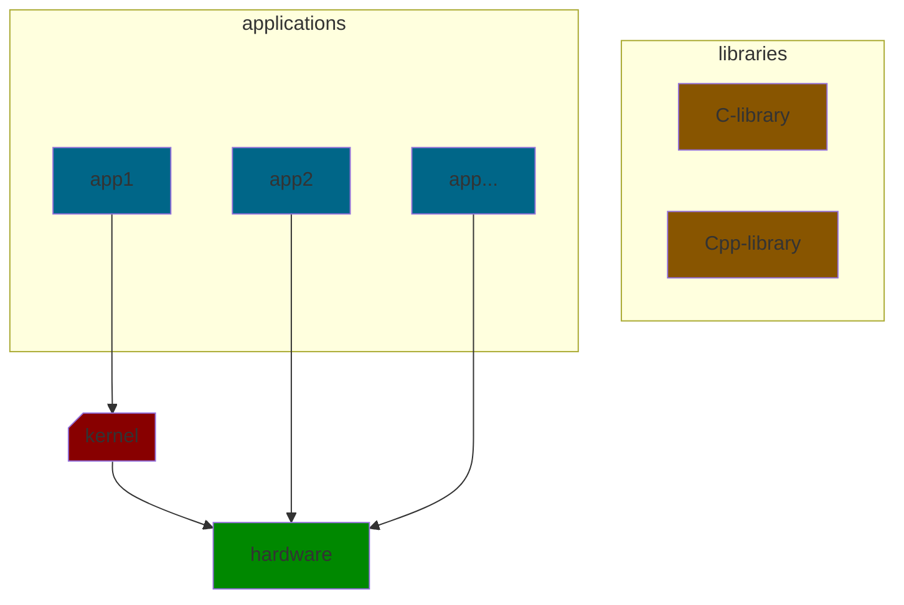
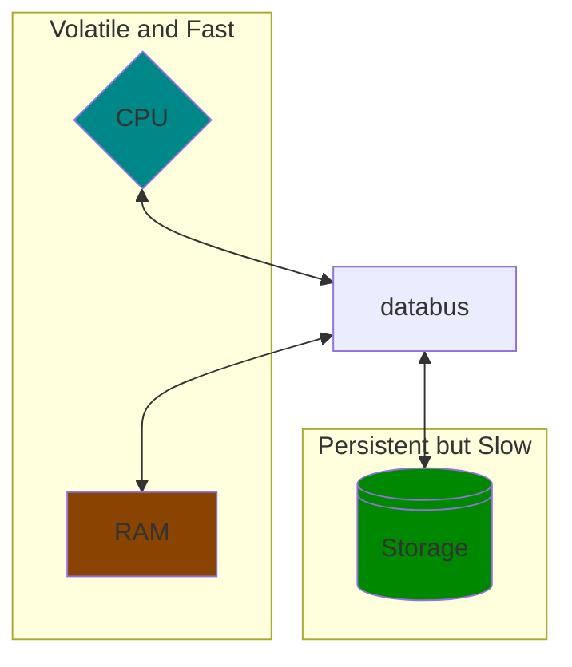

# Files and Shell Scripting Lecture Notes

The hardware used in this class will be `x86-64`

In simple terms, the Linux terminal has many commands. Some of them are:

* addition
* subtraction
* load
* read/write file
* shutdown
* halt

`Applications` are called by the `kernel`, which is built on top of the `hardware`. 99.9% of the time, the applications interact directly with the hardware. Additionally there are `libraries`, which are collections of pre-compiled code that can be re-used in programs. Kernels have permissions while libraries do not have permissions!



Emacs is an IDE that allows text manipulation and shell commands. Emacs is modeful, so many commands start with Control and Meta keys. Additionally Emacs has `electric` features. Creating a newline will match the previous line's indentation.

`Killed` text can be brought back at any position.

`Deleted` text cannot be brought back at any position, but it may be brought back with undo.

`Yanking` a text means to bring back killed text.

Emacs has an autosave feature in case the application crashes. Files that are autosaved begin and end with a `#` character.

`Minibuffer` or `Echo area` the bottom of the screen where you type commands.

`Mode line` area above the Minibuffer. This typically says `fundamental` when you begin an emacs session.

`Major Modes` makes a few commands behave differently.

* Fundamental Mode
* Text Mode

`Minor Modes` minor modification in major modes that can be toggled.

* Auto Fill Mode

---



### 3 Goals of a File System

1. Survive Power Outages
2. Be Fast
3. Be understandable for users and developers

We are using the `Linux POSIX file-system`. `Regular files` are ordinary files. They can be executable files like scripts or text files. Regular files have a finite byte sequence. `Directories` map the file name components to a file. They are not actual locations of the files, they act like a placeholder for where those files are located. File name components have a nonempty finite byte sequence. Some special cases that are in all directories are the `.` and `..` names. Directories typically have a limit of 255 bytes.

`.` refers to the current directory.

`..` refers to the parent directory.

### Special Shell Commands

`!!` repeats the previous commands with appended changes.

`/.` accesses the contents linked to a symbolic link rather than the symbolic link itself.

`df` displays information about the file systems adn disk space usage.

`su` and `sudo` are acronyms for super user do commands. When using the SEASnet Linux servers, take care not to use these commands or the admistrators will be notified that you are trying to break into their system.

Files do not have 9 permissions, they have 12 permissions.

`-rwxr--r--` is a typical regular file with the Octal permission 744.

`drwsr--r--` is a directory with the Octal permission 4744.

this can also be written as `d 100 111 100 100`. The first digits of the permission stands for `set-uid`, `set-gid`, and `sticky bit` respectively.

When you want to use standard input as an argument: use `-` as the argument.

`rm` command does not truly delete a file if someone is accessing it. It gets rid of the link between directory entries.

```
    (rm ouch; cat) < ouch
    // where ouch contains some text
```

This sample removes the ouch file's hard link from our current directory, but it does not delete the text from memory until the cat operation has been done.

### Symbolic Links

* can link to files that don't exist yet
* can link to directories
* can link to other file sytems (hard links cannot)

contents of a symlink is a nonempty string of bytes sliced into a file name.

`absolute` file names start at the root directory: `/bin/sh`

`relative` file names start at the current directory: `./assignment1`

`<&-` closes standard input.

To send errors to a file append the redirection operator with a 2.

```
    ./hello.c <&- > output 2> error
```

In Emacs:

* `files` are data in secondary storage (OS notion - visible to all apps)
    * there is `metadata` (timestamps, ownership, permissions, etc)
        * metadata is managed by OS
        * OS is in charge. Program makes the request.
* `buffer` is the data in Emac's "RAM". It is volatile and does not survive power outages.
    * the buffer is invisible to all other programs (but with user/or root, it can override this).

Files beginning with "." are less visible to users.

Emacs creates file names starting with `#` to hold contents of buffers even when you havent saved the buffer. It does so periodically, not all the time (that would be too slow).

Emacs creates dangling symlinks with names starting with `.#`.

* when you exit Emacs, it stops the program in the background. You can use the command `fg` to bring it back to the foreground. If you start a 2nd process of Emacs, you can use `C-x C-z fg` to bring back the originial process.

`ps` displays process status. The option `-e` displays all processes and `-f` displays more details.

Redirection operators take input from streams and outputs to other streams.

* `<` take stdin from file `stream 0`
* `>` put stdout to file `stream 2`
* `2>` put stderr to file `stream 2`

```
    command > outfile 2>&1
```
This makes stream 2 point to the same thing at stream 1. 

Aditionally pipe, `|`, makes commands run in parallel as opposed to `;` which makes commands run sequentially.

`$?` stands for the exit status of the most recently called command.

By doing `echo $?`, and output of:

* `0` means success
* `1-255` anything else is failure

### In Lisp mode

```lisp
    (+ 5 12) // C-j
    17

    (kill-emacs)
```

`C-j` runs the previous line's command. 
