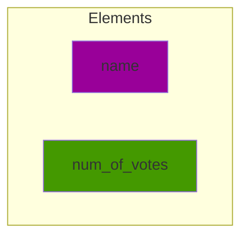
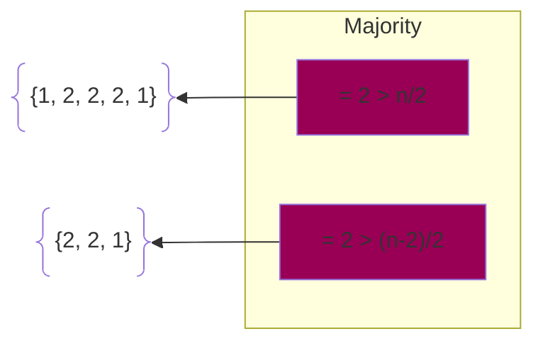
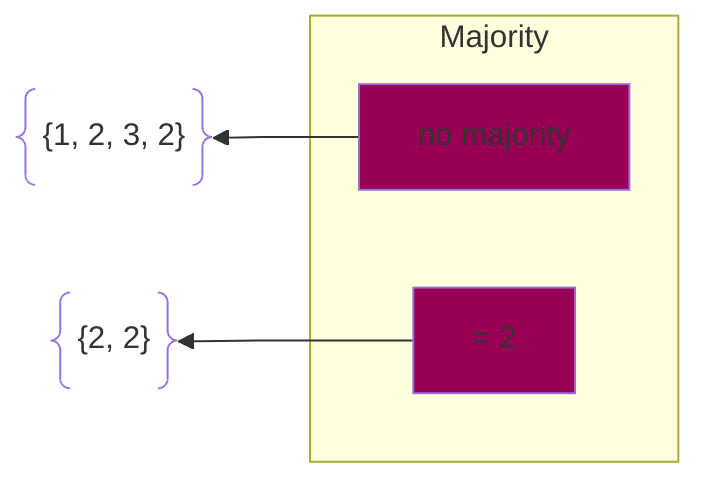

# Majority Problem

There are `n` candidates in a list and we want to determine who is the `majority` in the list. 

A `majority` is when there are more than `n/2` votes for a candidate. There can only be 0 or 1 majorities in each list of candidates because every candidate only has 1 vote.

### Restrictions:

The algorithm must be `in-place`. There can only be a constant number of extra storage. The storage cannot scale with the number of inputs.

### Solution:

Using this storage, we can iterate through each candidate, and then through the list for if they have a matching vote with candidate. This takes `n` time for one candidate and there are `n` candidates. This would result in $O(n^2)$ time.

A different approach we can take to solve this problem is taking advantage of the fact that deleteing two unequal votes will simplify the search for the majority vote. 

* Property 1: If we have a majority, when we delete two unequal values, the majority remains the same.

* Property 2: if we do not have a majority, deleting two unequal values **may** create a majority.

Either way, if we delete until we reach 1 or 0 elements left in the list, we can determine if we have a majority. If there is 0 elements left in the list, there is no majority in our list. If there is 1 element left in our list, it may be a real or a fake majority. The diagram above shows a fake majority.

To delete the different candidates, we must adopt a method to reduce the runtime. We can do this by iterating through each element with a candidate and constant variable. When the constant variable becomes 0, we remove the candidate number. When there is no candidate, the next element in our list becomes our candidate. We iterate through the list to check if candidate is equal to the current element. If it is equal, we add 1 to constant, if not we subtract 1. By the end, we will have either no candidate, or 1 candidate. This process takes $O(n)$ time.

After doing the delete of different candidates, we do a linear check of the original list. If the number of elements that match the majority candidate is greater than `n/2`, then we have the majority candidate. This process also takes $O(n)$ time.

Overall, our runtime $= O(n) + O(n) = O(n)$

