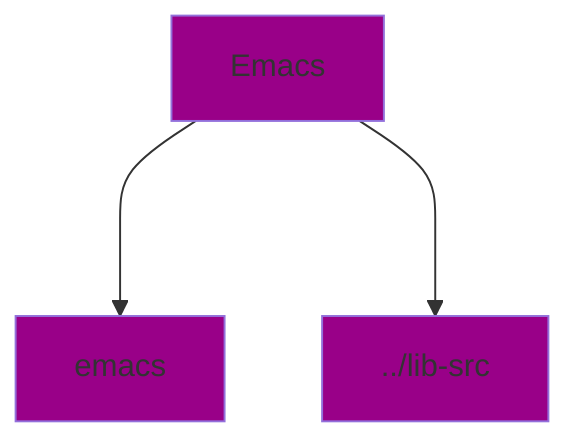

# Make files

1. Autogen creates files not stored in git, includes configure shellscript
2. `./configure` creates files designed for building on this machine
    * interrogates current build system for tis capabilities
    * can result in you doing stuff to get it to configure
    * more platform specific files - `makefiles`
3. `make` executables + compiled files

`make check` does self check on the files we have built but not installed. Also called `unit tests`

`make install` exports it to the rest of the system

`makefile` the recipe for a build

* target: dependency list, commands

make has a dependency graph

The benefit of having a makefile as a graph, is that you can build in parallel. Shell cannot be ran in parallel as easily.

`/proc/cpuinfo` tells you information about your machine

Example: intel core i5-13354

Raptor Lake:

* 2 P cores (performance), hyperthreaded
* 8 E cores (efficiency)

`hyperthreaded cores` can execute 2 instructions in parallel (2 threads per core)

Therefore we can run 12 threads simultaneously

`make -j12` will make 12 processes run simultaneously

* by default `make -j` will run as many processes as possible

